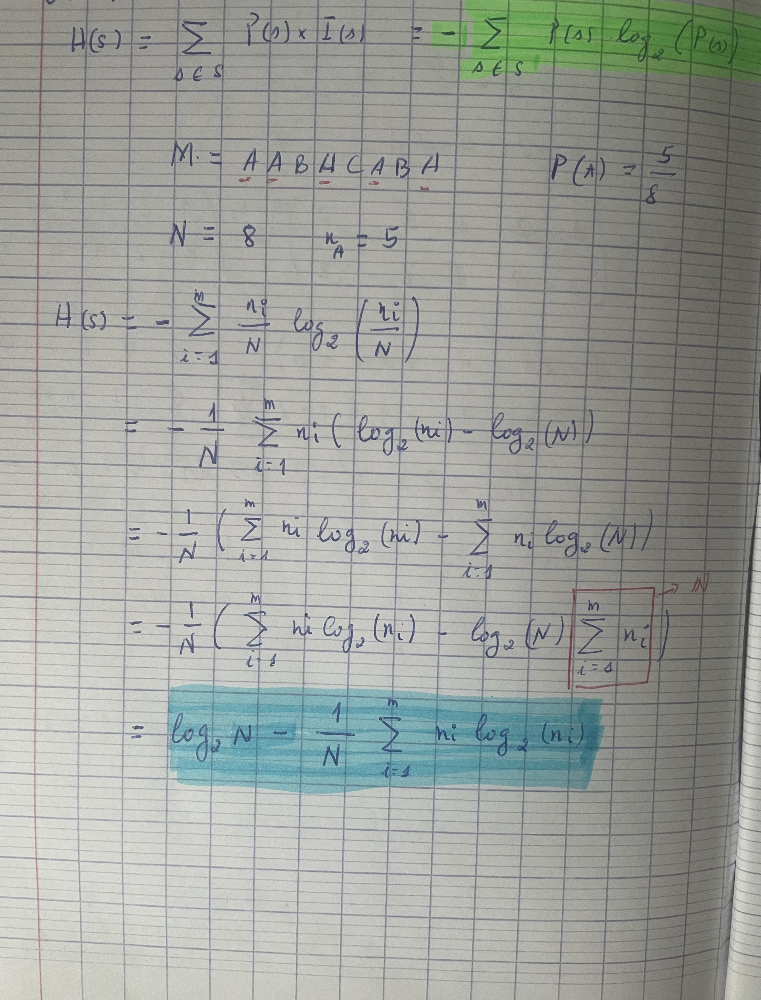

# Rendu tp 1 CDC :

- Sujet : 
[Le sujet](https://www.fil.univ-lille.fr/~salson/portail/cdc/tp/TP-Entropie/enonce.html)

**Objectifs du TP**

- Comprendre la notion d’entropie
- Coder un calcul de l’entropie de fichiers
- Évaluer l’entropie de divers types de fichiers

**1.1**  
La valeur maximale de l’entropie d’un fichier est **8 bits**. Cette valeur est atteinte Lorsque les octets d'un fichier sont répartis uniformément.

**1.2** 

Verification de la formule : 

**2.7** 

Au mieux, la taille d'un fichier codé avec un codage optimal est n(c) * la taille du fichier en octet.

